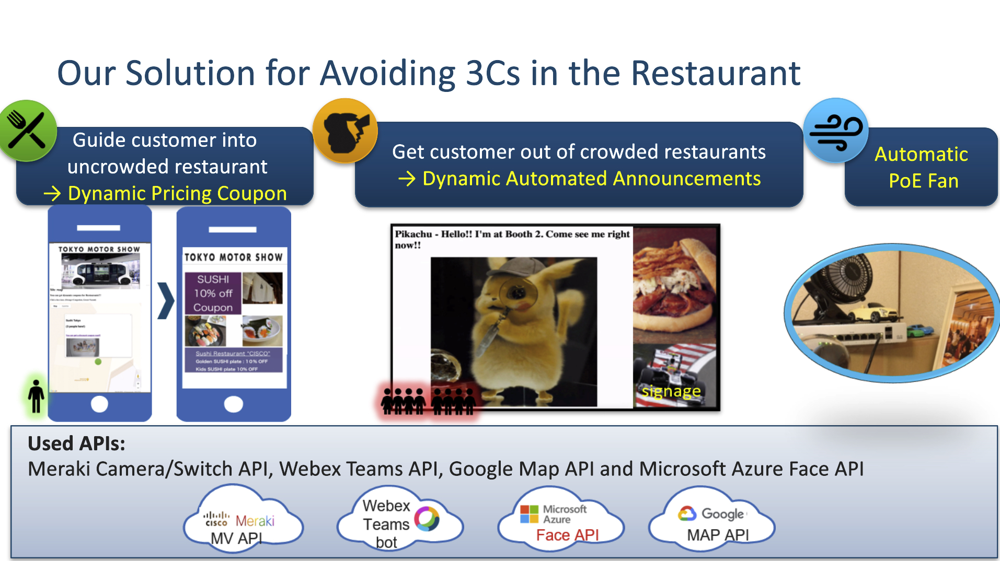

# Avoid the 3Cs via Meraki Camera

We are proposing digital convention center solution using Cisco Products and API, for post COVID-19 new normal.

* Business Summary

    Under Covid-19 new normal, we must avoid the 3Cs (closed spaces, crowded places, close-contact settings ) to control the infection.

    A large Convention Centers where many people gather is worried about how to hold events in new normal.

    Their primary concern is Restaurants becoming especially crowded during breaktimes.

    We are proposing three innovative digital solutions with using Meraki, Teams, Azure & Google APIs.



The combination of these 3 solutions enables to control the flow of customers, help us avoid the 3Cs and prevent the spreading of infection.

* This use case is based on these products:

    * Meraki Camera MV (People Count and Snapshot API)

    * Meraki Switch MS (Switch Ports API)

    * Webex Teams: Bot & Message API

    * Azure Face API

    * Google Maps API

## Use Case Description

* Solution 1: Guide customers into vacant restaurants. We will have a method of creating discount coupons only for vacant restaurants.

    * Build an event web page with Python + Flask.

    * Get the number of people detected by the camera at each restaurant with Meraki MV Sense API.

    * Get a site map with Google Maps API and display the location of the restaurant with an icon on the web page.

    * Based on the number of people detected by the camera, the color of the restaurant icon will be changed to green (= not crowded) or orange (= crowded) to show the degree of congestion.

    * When you click the icon of a vacant restaurant, a hyperlink is  displayed  to jump to another web page where you can get a coupon .

    People choose cheap and uncrowded restaurants, so this solution can guide people to vacant restaurants

* Solution 2: When the restaurant gets too crowded, we would like to encourage customers to leave crowded restaurants. For this, we plan to use Digital Signage. The signage will dynamically generate and display automated announcements for the existing customer. We then believe, customers will be drawn to events about to begin, and then leave the restaurant.

    * Build a digital signage(web page) for crowded restaurants with Python + Falsk.

    * Get people count with Meraki MV sense API periodically.

    * When the restaurant is not crowded, the default advertising screen is displayed on the digital signage.

    * When the restaurant is crowded,

        * Take a snapshot with the restaurant's camera using Meraki Snapshot API.

        * Analyze the  snapshot image with Face API of Microsoft Azure to identify the age group with the largest number of people in the image.

        * The restaurant's digital signage screen has changed from the default to show event information that is of interest to the largest age group.

    For example, If children are the most common age of the people in the restaurant, the signage shows Pikachu with the latest Webex Teams message like a “I’m at Booth 1 !! Come See me right now!! “  that he sent.

    Pikachu always moves to the empty space of the event venue to avoid 3Cs and sends a message to the Webex Teams bot to let them know his latest location.

    Many kids love Pikachu, so families with children rush out of the restaurant to meet Pikachu and the restaurant is less crowded.

    This solution eliminates restaurant congestion

* Solution 3: Automatic fan turned on when the restaurant starts to get crowded.

    * Build a fan management web page with Python + Flask.

    * Get people count with Meraki MV sense API periodically.

    * When a restaurant is crowded,  enable the PoE port connected to the restaurant's camera with Meraki Switch API to start to the operation.

    Ventilation for the crowded restaurant is improved by the automatic fan.  

## Installation

Make sure you have Python3 installed.

```
$ git clone https://github.com/ayamazak/Avoid-the-3Cs_via_Meraki-Camera.git
$ cd Avoid-the-3Cs_via_Meraki-Camera
$ pip install -r requirements.txt
```

## Configuration

Edit settings.toml file.

```
token = '' #Webex Teams Token
subscription_key = '' #Azure Subscription-Key
maps_key = '' #GoogleMaps-Key
apikey= '' #Meraki-API-Key
room_id = '' #Webex Teams roomId
mentioned_id = '' #Webex Teams mentionedPeople
network_id = '' #Meraki Network ID
mssn = '' #Meraki MS S/N
camlist = [] #Meraki MV S/N List
```

## Usage

```
$ flask run
```

* Solution 1

    http://0.0.0.0:5000

* Solution 2

    http://0.0.0.0:5000/signage

* Solution 3

    http://0.0.0.0:5000/fan
